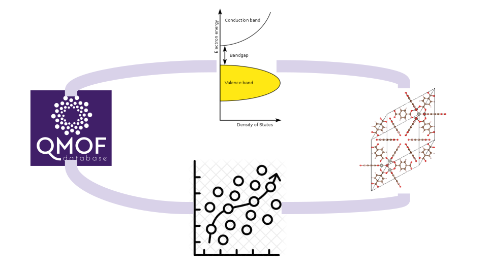

# CH-359 Projects in Computational Chemistry @ EPFL

Supporting scripts, tutorials and materials for CH-359 Projects in Computational Chemistry @ EPFL

## How to approach this repository

The following steps assume that you use MacOS or some Linux flavor. If you use Windows, we recommend that you first install the [Windows Subsystem for Linux (WSL)](https://learn.microsoft.com/en-us/windows/wsl/install).

Create a new folder and clone this repository (you need `git` for this, if you get a `missing command` error for git you can install it with `sudo apt-get install git` for Linux or `brew install git` for MacOS).

It is divided by 3 parts and inside each folder there will be an explanation on how to install the required packages, scritps to run (tutorials and exercises) and a commented solution.

You might need to install minconda before, check [here](https://docs.conda.io/projects/conda/en/latest/user-guide/install/).

Setup your environment with:

    $ git clone https://github.com/bmourino/ch359.git
    $ conda env create --file environment.yml
    $ conda activate ch359
    $ pip install umap pyeqeq oximachinerunner manage_crystal rdkit

Alternative (if taking too long):

    $ git clone https://github.com/bmourino/ch359.git
    $ conda install -c conda-forge mamba
    $ mamba env create --file environment.yml
    $ conda activate ch359
    $ pip install umap pyeqeq oximachinerunner manage_crystal rdkit

Keep the cloned folder clean, make a copy and edit everything there.
Before each block we will ask you to update your cloned folder with `git pull`.

# Overview

## MOFs 101

- Metal  Organic  Frameworks  (MOFs)  are  porous,  crystalline  materials 
formed by metal nodes connected by organic linkers.[1](https://pubs.rsc.org/en/content/articlehtml/2020/ta/c9ta13506e#fn1)
Explored for optoelectronic properties in, e.g., photocatalysis.[1](https://pubs.rsc.org/en/content/articlehtml/2020/ta/c9ta13506e#fn1)
- Goal:  Computationally  handle  MOFs  -  visualize,  clean  and  get  an 
overview on basic properties.

## MOF Database & Machine Learning

- Database on electronic properties of MOFs.[2](https://www.sciencedirect.com/science/article/pii/S2590238521000709)
- Goal: Quantitative structure property relationship modelling of MOF band 
gaps.
- How: Build ML models step by step, i.e., data preparation, model training, 
and  model  evaluation.  Compare  different  featurization  methods  and 
analyze their effects on models.

## MOFs & DFT: Digging deeper

- MOF-5 (CSD ID: MIBQAR, QMOF ID: qmof-a2d95c3): Explored extensively for its electronic properties.[3](https://pubs.acs.org/doi/full/10.1021/acs.jpclett.1c00543)
- Goal: Take a deeper, critical look into DFT band gaps.
- How:  Find  ground  state  and  perform  calculations  with  different 
functionals. Compare with literature, and with values predicted from your 
ML model.

## Learning outcomes

- Understand  advantages  and  limitations  of  ML  and  DFT  to  obtain  band 
gaps.
- Understand the difference between fundamental and optical gaps.

# Plan 2023-1

| Date  | Week  | Topic                    | Specifics     | 
| :---  | :---  | :---                     | :---          |   
| 23.02  | 1     | Introduction             | Project presentation and scripting tutorial        |   
| 01.03  | 2     | 1-MOF101             | Get familiar with mofchecker, oximachine, manage_crystal, visualization, basic features    |
| 08.03  | 3     | 2-ML Featurizer 1        |   Introduction to machine learning, featurize MOFs using statistical composition method |
| 15.03  | 4     | 2-ML Featurizer 2        |   Featurize MOFs using orbital field matrix, data preprocessing |
| 22.03  | 5     | 2-ML Model development   |   Develop a regression model   |
| 29.03  | 6     | 2-ML Model fine-tuning   |   Perform hyperparameter searching to fine tune the model developed last time  |
| 05.04  | 7     | 2-ML Model evaluation    |   Evaluate the model performance and stability, use the model to predict the band gap of MOF-5 |
| 12.04  | 8     | 3-DFT Looking for convergence  | Perform single point with different cutoff, rel_cutoff, with and without supercell     
| 19.04  | 9	 | 3-DFT Looking for ground state | Perform geometry optimization and cell optimization and work on what's left from 1 |
| 26.04  | 10 	 | 3-DFT Testing different flavors| Perform single point calculations with different functionals: GGA, hybrids and DFT+Hubbard	|
| 03.05  | 11    | 3-DFT Analyzing results	       | Plot density of states, analyze orbitals, and start with presentation	|
| 11.05  | 12    | Working on report and presentation	       |  |
| 18.05  | 13    | Public holiday	       |  |
| 25.05  | 14    | Mock presentation	       |  |
| 01.06  | 15    | Presentation	       |  |